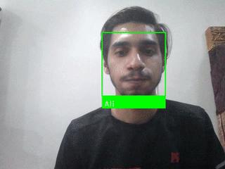

# Face_recognition

## Introduction
This repo provides a fast face recognition system that can work with cpu (no need for gpu). The implementation is based on the well-known libraries *dlib* and *face_recognition*.
This repo was made with the help of this two articles:
* [Adrian Rosebrock's article in pyimagesearch](https://www.pyimagesearch.com/2018/06/18/face-recognition-with-opencv-python-and-deep-learning/)
* [Adam Geitgey's article in Medium](https://medium.com/@ageitgey/machine-learning-is-fun-part-4-modern-face-recognition-with-deep-learning-c3cffc121d78)
## Method
The face recognition step works as follow:
* Find face in the image
* Align face (not currently implemented)
* Get the encoding of the face (a unique 128 vecotor representaion of the face). In this repo, Openface is used.
* Use a classification method to recognize the face in the image. The available methods are: min distance, highest vote,and svm model. 
## Scripts
There are 3 main scripts:
* train.py : expect a path of the *train* folder (The default is ./train). Inside this *train* folder, it should contain folders of the people to be recognized.
For example: 
```
- train/
  - Ali/
    - images 
```
Furthermore, inside each person's folder, it should contain images of only this person so that model does not get confused. 
Lastly, there is an option to create a svm model, otherwise the encodings will be used for prediction.

* test_accuary.py: used to test the accuary of the model. It expects a path for *test* folder that has the same structure as the *train* folder. The default evalution is using the produced encodings and highest vote model. In case, you want to use the svm model, you will need to provide the path of the file.
After runing the train.py, it can be found as *svm_model.sav*.

* web_cam.py: This is the main script. It will either use the encodings or the svm model generated from the ***train.py*** to recognize people in the image. There are 3 methods that implemented here: min distance, highest vote, and svm mode.
You can choose the method using *-rm* argument. 

## Installation
* 1-create a new conda environment 
```
conda create -n face_recognition python=3.6
conda activate face_recognition
```
* 2- Install dependencies
```
pip3 install -r requirements.txt
```
## Runing the scripts
First run the train script
* 1- train.py
option 1: produce encodings only (no svm model).
```
(default arugemnts)
python3 train.py -t ./train --svm 0
```
option 2: Encodings and svm model
```
python3 train.py -t ./train --svm 1

```
* 2- test_accuracy.py (optional)
```
Optoin 1: Using highest vote method. Here you can adjust the tolerance to make the model more accuarate.

python3 test_accuary.py -p ./test -t 0.45

Option 2: Using svm model

python3 test_accuary.py -p ./test -c "svm_model.sav"
```
* 3- run web_cam.py
```
option 1: min distance 

python3 web_cam.py -rm "min"

option 2: highest vote (choose the tolerance).Here you can adjust the tolerance to make the model more accuarate.

python3 web_cam.py -rm "svm" -t 0.45

option 3: svm model

python3 web_cam.py -rm "svm"
```
## Feature works
* Siamese network to produce a better encodings to people to be recognized. 
* Add face alignment 
